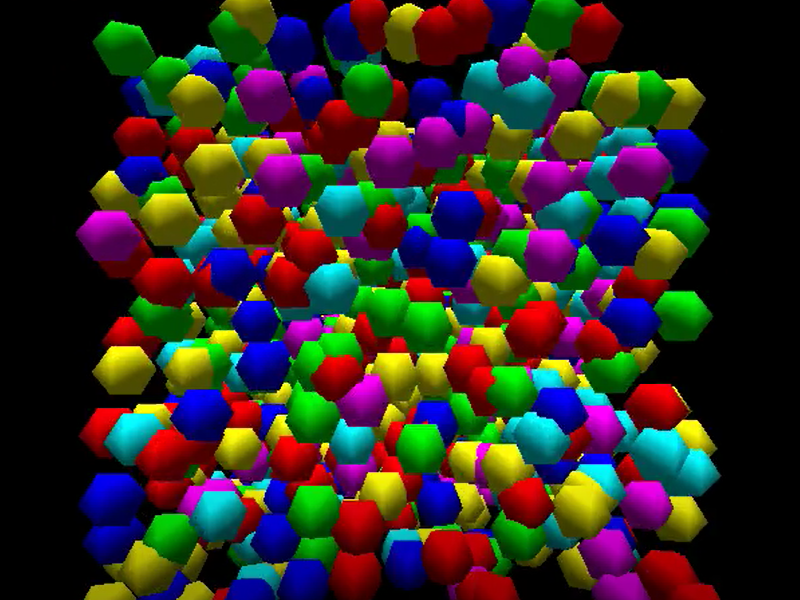

Quanta-1
===

Presently this is a simulation of Newtonian spheres. They bounce off of each
other in a mesmerizing OpenGL display.

Building
===

Dependencies
---

  * SDL2 http://libsdl.org/
  * GNU Make
  * g++ post 2011
    * MSYS2 for Windows http://www.msys2.org/
  * Lazy C++ http://lazycplusplus.com/
  * GLEW http://glew.sourceforge.net/

Download GLEW and Lazy C++ to vendor. The ~LZZ~ variable is used to control
where lzz can be found. ~GLEW_CFLAGS~ and ~GLEW_LDFLAGS~ can specify the path
to the built GLEW includes and library.

Linux / OS X
---

Download and install SDL2 development libraries. OS X users can get them
from http://libsdl.org/download-2.0.php while *nix users should use their
package manager.

Then:

  > make RELEASE=1 all
  > ./quanta-1

Windows
---

After installing MSYS2 you need to install SDL2 with Pacman:

  > pacman -S mingw-w64-x86_64-SDL2
  > make WINDOWS=1 RELEASE=1 all
  > make WINDOWS=1 run

Build flags
---

Make accepts a few options that control the simulation:

  * RELEASE=1		Optimizes the code with -O3

  * WINDOWS		Build for Windows
  * RASPBERRY		Build for Raspberry Pi

  * GLEW_CFLAGS		CFLAGS needed for GLEW
  * GLEW_LDFLAGS	LDFLAGS needed to link with GLEW

  * WRAPAROUND=CUBE	Cubed universe
  * WRAPAROUND=SPHERE	Spherical universe

  * CHEAP_MATH		Use floats instead of doubles
  * SLOW_VECTOR		Do not use SIMD

Usage
===

Keys
---

  * WASD + mouse	Move and look around FPS style
  * R, F		Change speed
  * -, =		Change quanta speed
  * Return		Shoot quantum
  * '			Create singularity
  * L			Create uniform singularity
  * O, P		Give singularity forward velocity
  * F6			Swap colors on collision
  * F7			Take a screenshot and save to current directory
  * Alt+F7		Toggle continuous screenshooting

Command line Arguments
---

Currently these are positional:

  * Number of quanta in singularity
  * Size of singularity
  * Size of universe if wrapping around
  * Speed of new quanta

Legal
===

Copyright (C) 2016-17 Nolan Eakins <nolan@eakins.net>
All rights reserved.
